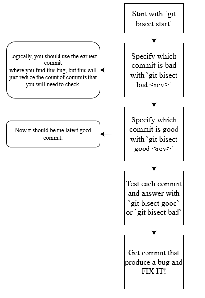

Sources for the article:
- [Git - Reference](https://git-scm.com/docs)

`git` is one of the most important parts of a developer's tools, but some of its features are not well known to most developers.

In this article, I want to show some advanced approaches and interest techniques that could help with resolving bugs, improving the working process, etc.


## `git bisect` for debugging

`git bisect` is a debugging tool that will help you find when a bug was created in your commit's history. To start using this tool, you need to have a bad commit (in which a bug was found) and a good commit (in which you don't have this bug). By using binary search bisect will try to find which commit was the initiator of this problem.

Example:

I have found a bug, that fully crashes my app after loading the web page. For founding this bug, I could use `git bisect`:

```
git bisect start

git bisect bad # or git bisect bad <rev>
git bisect good v1.0.0
```

As a rev you could use a version or commit hash.

Now after each message from `git bisect`, you will need to check if you can reproduce the bug. If you can then answer, `git bisect bad` or `git bisect good` otherwise.

In the end you will get the revision that created this bug.

You could use `git bisect log` for checking logs; this could be helpful if you forget where you stopped.



## `git stash` for quick saving changes

`git stash` is commonly used for quickly saving changes without creating a commit. Ordinary usage would look like this:

```
# When you need to temporarily save some changes
git stash

# When you need to get back these changes
git stash pop
```

Additional cases:
1. When you don't need to get the latest stash.
In this case you could use `git stash list` for getting list of all stashes and `git stash <stash-index>`.

Example:

You get such input from `git stash list`:
```
stash@{0}: WIP on (no branch): a3c5995 create feature 
stash@{1}: fix problem
```
For the first index you could use just `git stash pop`; for using another index you could use:
```
git stash pop stash@{1}
```

2. Problem with merging stash and current state.
Sometimes I find myself in such a situation. A few times I used `git stash pop` not properly; for example, I needed to pop stash state one time, and instead of this, I repeated this command twice. **In such a case you need to resolve the merge conflict.**

## `git revert` for reverting commits

`git revert` could help you create a commit that will revert changes to the commit that you select. Optionally, you could not create a commit after each `git revert`; in this way, you could revert multiple commits, and after this, create commit with all these changes:

```
git revert <rev>

# OR

git revert -n
git add -A
git commit -m 'revert fixes ae423, 1fkvu and k14mvs'
```

## `git submodule` for using another git project as dependency

This technique could help to use another git repository as a dependency. This could be helpful for various needs: using repo as package, saving configurations, etc.

A project that has submodules is called a **superproject**.

To add a submodule, run these commands:

```
# This command will add repo as a submodule for your project
git submodule add <URL> <path>
```

[More info about git submodules](https://git-scm.com/docs/gitsubmodules).

## `git reflog` for fixing mistakes

reglog stands for "Reference logs", records when the tips of branches and other references were updated.

In general this will look as git history for most users.

`git reflog show` command shows history of changes made to git repo.

With such command you could go to prev revision and use it state to create branch and restore lost changes.


